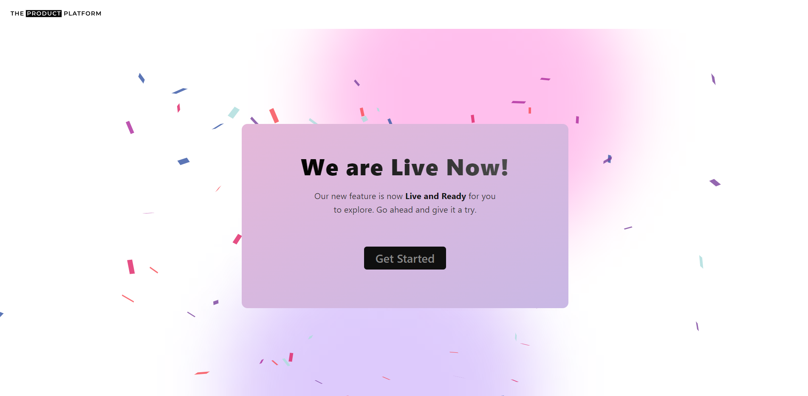

## Assignment: Launch-Page

In a world where first impressions matter more than ever, a countdown landing page can be a powerful tool to create buzz, generate leads, and drive conversions. Whether you're launching a new product, organizing an event, or counting down to a major announcement, our Countdown Landing Page is the perfect solution to captivate your visitors and turn their curiosity into action.

With a clean and modern design, intuitive functionality, and seamless responsiveness, this landing page provides a simple and efficient way to communicate the urgency and significance of your upcoming event. Engage your audience, gather valuable insights, and enhance your online presence with a countdown landing page that reflects your brand's identity and objectives.

Feel free to customize this introduction to fit your specific project and company details.

- Set the initial timer for 2 minutes. You can increase/decrease the timer in the timerSlice created in the Redux Store.

### Home page

### Live Event Page

### Email Validation

- Email stored in userSlice (Redux store)
  

- If email of user is already stored in redux-store then shows an alert mesage.
  
